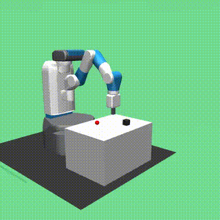
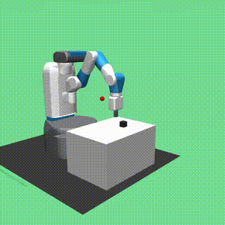
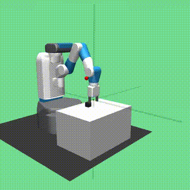
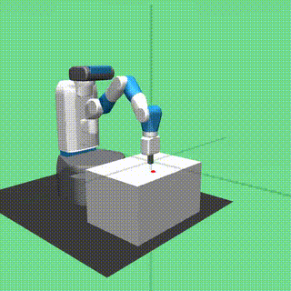
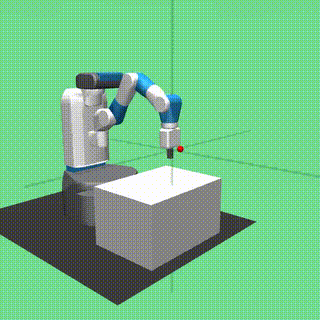
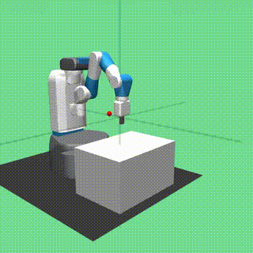
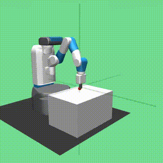

# AIPI 590: Challenge 3 — RL in the Physical World

[](https://www.python.org/)
[](https://mujoco.org/)
[](https://stable-baselines3.readthedocs.io/)
[](LICENSE)

Training robotic grasping and reaching policies in MuJoCo simulation using SAC + Hindsight Experience Replay, with analysis of sim-to-real transfer gaps against physical robot hardware.

---

## 🎮 Interactive Visualization

**[View Interactive Policy Rollouts →](https://aipi590-ggn.github.io/aipi590-challenge-3/)**

Explore trained policy episodes with playback controls, speed adjustment, and real-time statistics.

## Notebooks

| Task | Notebook | Open in Colab |
|------|----------|---------------|
| Manipulation (Main) | [challenge3-pickandplace.ipynb](notebooks/challenge3-pickandplace.ipynb) | [](https://colab.research.google.com/github/aipi590-ggn/aipi590-challenge-3/blob/main/notebooks/challenge3-pickandplace.ipynb) |
| Reaching (Experimentation) | [challenge3-reach-experimentation.ipynb](notebooks/challenge3-reach-experimentation.ipynb) | [](https://colab.research.google.com/github/aipi590-ggn/aipi590-challenge-3/blob/main/notebooks/challenge3-reach-experimentation.ipynb) |

- **pickandplace**: 1M timesteps, FetchPickAndPlace-v4 (grasping & manipulation)
- **reach**: 200k timesteps, FetchReach-v4 (reaching task)

## Trained Policies

Downloadable from [GitHub Releases](../../releases):

- `v1-challenge3-1m` — SAC+HER policy (1M steps, FetchPickAndPlace-v4)
- `v1-challenge3-200k` — SAC+HER policy (200k steps, FetchReach-v4)

## Rollout Videos

### FetchPickAndPlace-v4 (1M steps)

<table>
  <tr>
    <td></td>
    <td></td>
    <td></td>
    <td></td>
    <td></td>
  </tr>
</table>

### FetchReach-v4 (200k steps)

<table>
  <tr>
    <td></td>
    <td></td>
    <td></td>
    <td></td>
    <td></td>
  </tr>
</table>

## Key Decisions

- **Algorithm**: SAC + HER (Soft Actor-Critic + Hindsight Experience Replay)
  - Off-policy, sample-efficient, handles sparse rewards
  - HER relabels failures as successes toward achieved goal

- **Simulation Budget**: 1M timesteps (main), 200k (v1)
  - ~25 min on A100, ~60 min on T4

- **Live Visualization**: 4-panel training dashboard (ECharts)
  - Episode reward, success rate, actor/critic loss, entropy coefficient
  - Updates every 2k steps

## Known Gaps (Sim-to-Real)

1. **Contact & Gripper Modeling** — finger compliance, micro-slip
2. **Actuator Fidelity** — backlash, control loop latency (~10ms ROS 2)
3. **Observation Noise** — encoder resolution, camera pipeline latency
4. **Zero Calibration Drift** — per-joint errors compound through kinematic chain
5. **Domain Randomization** — table friction, object properties, action delay

## Structure

```
aipi590-challenge-3/
├── notebooks/
│   ├── challenge3-pickandplace.ipynb          # Main: 1M steps, FetchPickAndPlace-v4
│   └── challenge3-reach-experimentation.ipynb # Experimentation: 200k steps, FetchReach-v4
├── scripts/
│   ├── colab_utils.py                         # Colab automation (publish, live charts)
│   └── trajectory_extractor.py                # Extract trajectories for visualization
├── docs/
│   ├── index.html                             # Interactive Three.js viewer
│   ├── data/                                  # Trajectory JSON (per-task versioned files)
│   └── meshes/fetch/                          # Fetch robot STL collision meshes
├── results/
│   ├── fetchreach/                            # FetchReach-v4 (200k steps)
│   └── fetchpickandplace/                     # FetchPickAndPlace-v4 (1M steps)
│       ├── models/                            # Trained policy checkpoints
│       ├── videos/                            # Rollout episodes (mp4 + gif)
│       ├── plots/                             # Training curves
│       └── eval_logs/                         # SB3 evaluation logs
├── requirements.txt
└── README.md
```

---

## Setup

Each notebook is self-contained and installs dependencies automatically. To run locally:

```bash
pip install -r requirements.txt
```

Then run a notebook in [Google Colab](https://colab.research.google.com) or Kaggle.

### Trajectory Visualization

The interactive visualization loads trajectory data generated by the notebooks. Trajectories are saved with versioned filenames to prevent overwrites:

- **FetchReach model** (200k steps) → `docs/data/trajectories-fetchreach-5ep.json`
- **FetchPickAndPlace model** (1M steps) → `docs/data/trajectories-pickandplace-5ep.json`

When you run a notebook, trajectories are automatically extracted and saved with the appropriate versioned filename. The interactive viewer tries each in order and loads the first available dataset.

---


## Team

Lindsay Gross · Yifei Guo · Jonas Neves

Duke University · AIPI 590 · Spring 2026
